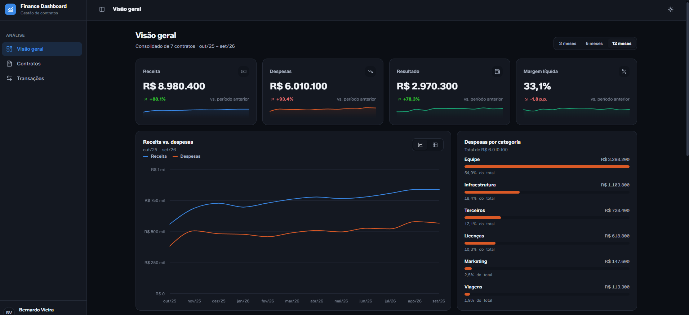
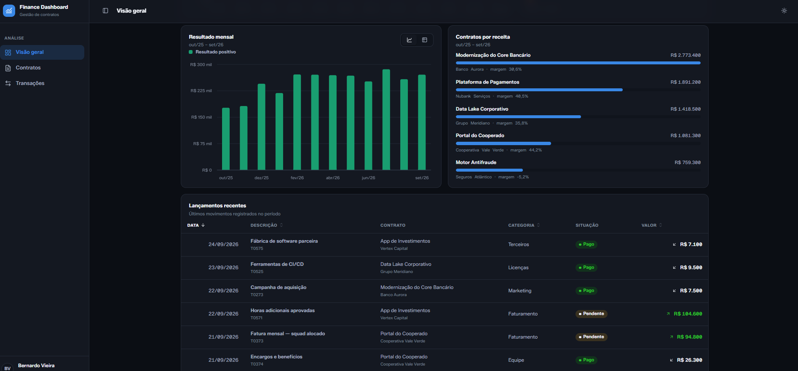

# Finance Dashboard


Painel financeiro para gestão de contratos, receitas e despesas. Todos os KPIs, gráficos e tabelas são derivados de um único ledger de transações — então nenhum número na tela pode discordar de outro.



## Funcionalidades

- **Visão geral** com KPIs (receita, despesas, resultado, margem), variação percentual contra o período anterior e gráfico de receita vs. despesas
- **Contratos**: listagem ordenável/paginável, ranking dos principais contratos e página de detalhe por contrato
- **Transações**: tabela filtrável com busca
- **Tema claro/escuro** persistente, seguindo o sistema operacional até o usuário escolher manualmente
- **Todo gráfico tem uma tabela**: cada visualização pode alternar para uma versão tabular dos mesmos dados
- **Layout responsivo**: sidebar retrátil no desktop, drawer com fechamento por `Escape` no mobile
- **Dataset simulado e determinístico**: 24 meses de histórico gerados com uma seed fixa, então os números não mudam a cada reload

## Stack

| Camada | Tecnologia |
|---|---|
| UI | React 19 |
| Build | Vite 7 |
| Roteamento | React Router 7 |
| Gráficos | Recharts 3 |
| Ícones | lucide-react |
| Classes condicionais | clsx |
| Estado de tema | Context API |
| Estilo | CSS puro com design tokens (sem framework de UI) |

## Como rodar

```bash
npm install
npm run dev       
npm run build     
npm run preview   
npm run lint       
```

## Arquitetura

Os componentes são organizados por responsabilidade, não por página — cada pasta corresponde a uma camada, da fundação até as telas:

```
src/
├── app/providers/      # ThemeProvider, ThemeContext — tema claro/escuro
├── components/
│   ├── ui/               # Primitivos: Card, Button, Badge, Pagination, SearchInput...
│   ├── layout/           # AppShell, Sidebar, Topbar — casca da aplicação
│   ├── charts/           # Wrappers do Recharts: RevenueExpenseChart, ProfitChart...
│   ├── tables/           # ContractsTable, TransactionsTable, SortableHeader
│   └── dashboard/        # KpiCard, TopContracts
├── pages/                # Overview, Contracts, ContractDetail, Transactions
├── hooks/                # useFinanceData, useSort, useChartTokens, useMediaQuery...
└── lib/                  # dataset.js (dados mockados) e format.js
```

**`useFinanceData`** é a única fonte de agregação: recebe uma janela de meses (e, opcionalmente, um contrato) e devolve KPIs, séries mensais, breakdown por categoria e deltas — numa só passada, memoizada. Nenhuma página soma os próprios números.

Gráficos são compostos, não monolíticos: `RevenueExpenseChart` só desenha as linhas do Recharts — legenda (`ChartLegend`), tooltip (`ChartTooltip`) e o fallback em tabela (`ChartDataTable`) são peças compartilhadas por todos os gráficos do painel, junto com o hook `useChartView` que controla o toggle gráfico/tabela.

## Design system

Os tokens vivem em `src/styles/tokens.css`. O tema escuro não é uma inversão automática do claro — as cores de série (receita, despesa, resultado) foram recalibradas à mão para a superfície escura, validadas para contraste e distinção entre cores.

## Dados

Todo o dataset é gerado em `src/lib/dataset.js` por um PRNG com seed fixa (mulberry32), então o histórico de 24 meses é sempre o mesmo entre reloads — não há backend, API ou banco de dados envolvidos.
